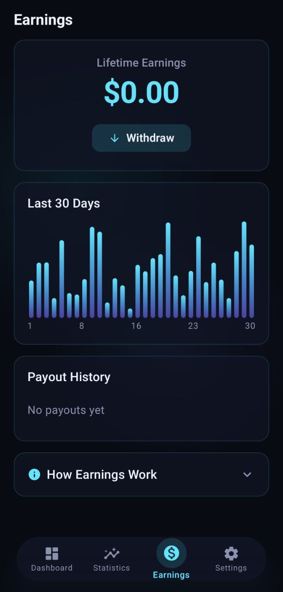

# NHP Android PoC

This folder contains the Android Proof of Concept for the NHP Protocol.

## Status: ✅ Live on Samsung Galaxy S24 Ultra

[**📥 Download Android APK (v1.0)**](../bin/NHP_Protocol_v1.0.apk)

### Screenshots — Samsung Galaxy S24 Ultra

| Dashboard | Statistics |
|:---:|:---:|
|  |  |
| **Earnings** | **Settings** |
|  |  |

## What This Proves

1. **Condition detection works** — the app reads real device state (charging, WiFi, screen) using native Android APIs
2. **Background persistence works** — ForegroundService keeps running when screen is off
3. **The UX concept works** — users see earnings accumulate passively without any interaction

## What This Does NOT Prove (Yet)

- Real NPU/TEE integration (requires manufacturer API access)
- Real AI task execution (currently simulated)
- Real payment settlement (currently simulated)

These are Phase 3–4 goals requiring manufacturer partnership and funding.

## Folder Structure

```text
nhp-app/
├── app/src/main/java/com/nhp/app/
│   ├── core/          # Hilt DI setup
│   ├── data/          # Simulator, DataStore, Repository
│   ├── domain/        # Models, interfaces
│   ├── presentation/  # Compose screens, ViewModels
│   └── service/       # ForegroundService
├── app/src/main/res/
│   ├── values/        # strings.xml (English)
│   └── values-ar/     # strings.xml (Arabic)
└── build.gradle.kts
```

## Requirements

- Android Studio Hedgehog or newer
- Android device or emulator API 26+
- For full ACTIVE state: physical device with charger + WiFi

## Quick Test

1. Open project in Android Studio
2. Run on physical device
3. Plug in charger
4. Connect to WiFi
5. Turn off screen
6. Wait 60 seconds
7. Turn on screen — check tasks count increased and earnings updated
