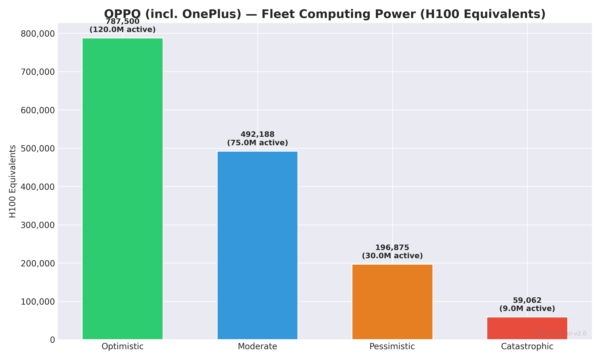
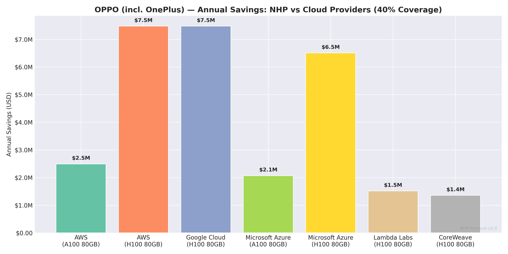
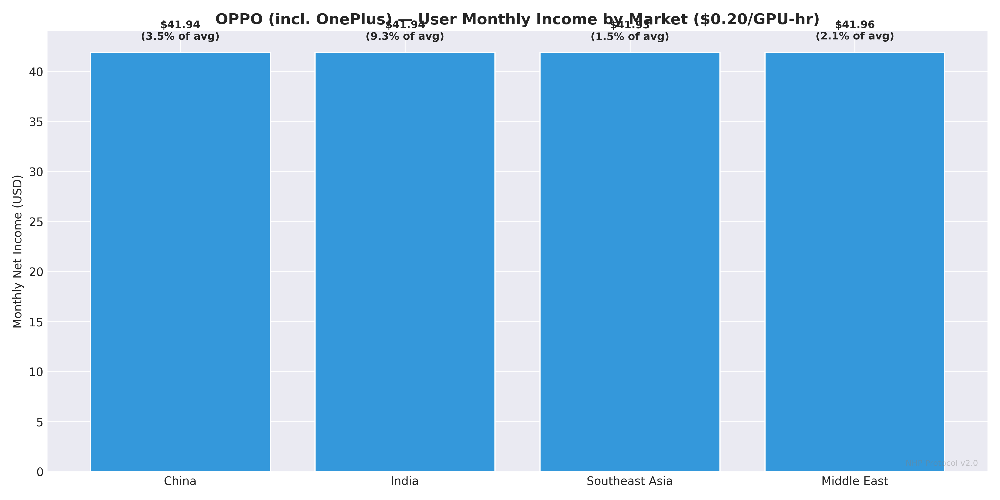
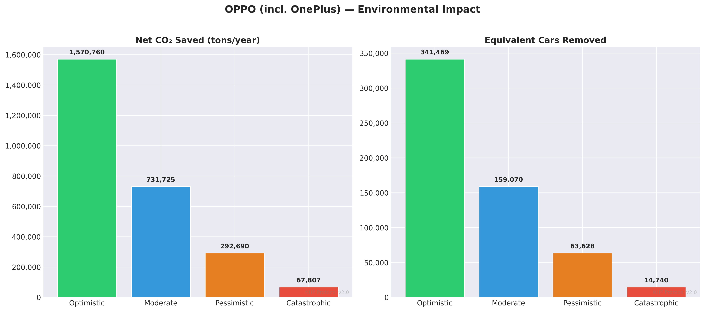
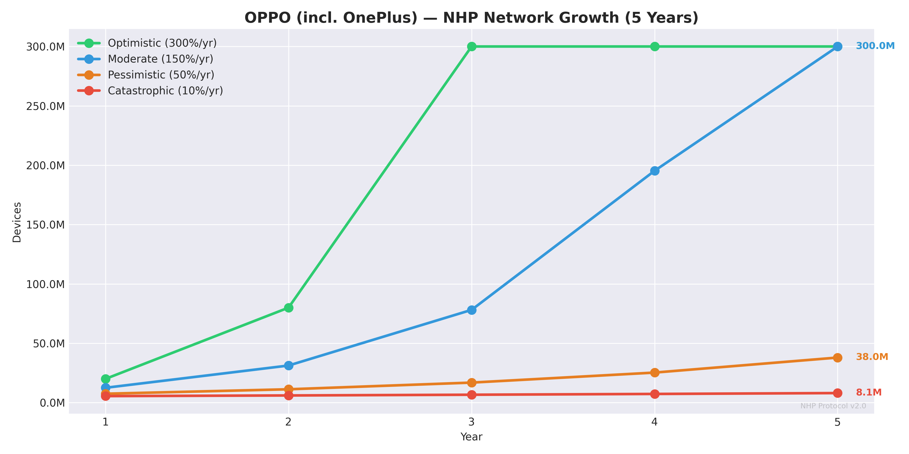
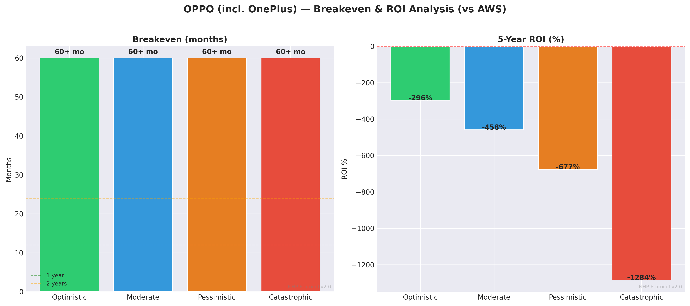

# NHP × OPPO (incl. OnePlus) — Deep Dive Report
# NHP × أوبو (ومنها ون بلس) — تقرير تفصيلي

**📅 Date: 25.02.2026 | Simulation v2.0**

---

## 1. Company Overview / نبذة عن الشركة

| Field | Value |
|---|---|
| **Name** | OPPO (incl. OnePlus) (أوبو (ومنها ون بلس)) |
| **Ticker** | Private (BBK) |
| **HQ** | China (الصين) |
| **Founded** | 2004 |
| **CEO** | Tony Chen |
| **Market Cap** | Private |
| **Annual Revenue** | $15B |
| **Market Share** | 8.5% |
| **Active Devices** | 300M |
| **Annual Sales** | 100M phones/year |
| **Primary OS** | ColorOS (Android) |
| **Primary Chipset** | Snapdragon 8 Gen 3 / Dimensity 9300 |

## 2. Device Fleet Analysis / تحليل أسطول الأجهزة

### Flagship Devices / الأجهزة الرائدة
| Model | Year | GPU | TOPS | RAM | Units (M) |
|---|---|---|---|---|---|
| Find X7 Ultra | 2024 | Dimensity 9300 | 35.0 | 16GB | 2M |
| OnePlus 12 | 2024 | Snapdragon 8 Gen 3 | 34.0 | 12GB | 5M |

### Mid-Range Devices / الأجهزة المتوسطة
| Model | Year | GPU | TOPS | RAM | Units (M) |
|---|---|---|---|---|---|
| OPPO A79 | 2024 | Dimensity 6020 | 8.0 | 8GB | 20M |
| OnePlus Nord CE 4 | 2024 | Snapdragon 695 | 6.0 | 8GB | 10M |
| OPPO A18 | 2024 | Helio G85 | 4.0 | 4GB | 30M |

### Fleet Computing Power / القوة الحسابية للأسطول

| Metric | Value |
|---|---|
| Total active devices | 300M |
| Avg flagship TOPS | 34.5 |
| Avg mid-range TOPS | 6.0 |

| Variant | Uptime | Active Devices | Fleet TOPS | H100 Equiv |
|---|---|---|---|---|
| 🟢 Optimistic | 40% | 120,000,000 | 1,575,000,000 | **787,500** |
| 🔵 Moderate | 25% | 75,000,000 | 984,375,000 | **492,188** |
| 🟠 Pessimistic | 10% | 30,000,000 | 393,750,000 | **196,875** |
| 🔴 Catastrophic | 3% | 9,000,000 | 118,125,000 | **59,062** |

## 3. Security & TEE Analysis / تحليل الأمان و TEE

| Property | Detail |
|---|---|
| **TEE Name** | Qualcomm QTEE / MediaTek TEE |
| **Description** | Uses standard Qualcomm and MediaTek TEE implementations. OPPO adds its own security layer via ColorOS. |
| **Maturity** | Developing |
| **Certifications** | CC EAL2 |
| **API Openness** | Open |

**TEE Readiness: 🟡 Needs work** | **API Access: 🟢 Easy**

## 4. AI Services Analysis / تحليل خدمات الذكاء الاصطناعي

### ColorOS AI
- **EN:** Camera AI, smart assistant, translation
- **AR:** AI الكاميرا، مساعد ذكي، ترجمة
- Daily requests: ~150,000,000
- Current cloud: Alibaba Cloud
- Est. annual cloud cost: $100.0M

### AI Strategy / استراتيجية AI
- **EN:** OPPO is part of BBK Electronics (also Vivo, Realme). Combined fleet of 800M+. They focus on camera AI and emerging market features. Partnership with OPPO could cascade to the entire BBK group.
- **AR:** أوبو جزء من BBK Electronics (أيضاً Vivo, Realme). الأسطول المشترك 800M+. يركزون على AI الكاميرا. الشراكة مع أوبو قد تمتد لمجموعة BBK بالكامل.

## 5. Cost Savings: NHP vs Cloud Providers / التوفير مقارنة بالسحابة

**Total daily AI requests: 150,000,000**
**Total daily GPU hours needed: 4,167**

### vs AWS (A100 80GB)
Annual cloud cost (100%): $6.2M

| Variant | Coverage | Annual Savings | Savings % |
|---|---|---|---|
| 🟢 Optimistic | 70% | **$4.4M** | 70% |
| 🔵 Moderate | 40% | **$2.5M** | 40% |
| 🟠 Pessimistic | 15% | **$934K** | 15% |
| 🔴 Catastrophic | 5% | **$311K** | 5% |

### vs AWS (H100 80GB)
Annual cloud cost (100%): $18.7M

| Variant | Coverage | Annual Savings | Savings % |
|---|---|---|---|
| 🟢 Optimistic | 70% | **$13.1M** | 70% |
| 🔵 Moderate | 40% | **$7.5M** | 40% |
| 🟠 Pessimistic | 15% | **$2.8M** | 15% |
| 🔴 Catastrophic | 5% | **$935K** | 5% |

### vs Google Cloud (H100 80GB)
Annual cloud cost (100%): $18.7M

| Variant | Coverage | Annual Savings | Savings % |
|---|---|---|---|
| 🟢 Optimistic | 70% | **$13.1M** | 70% |
| 🔵 Moderate | 40% | **$7.5M** | 40% |
| 🟠 Pessimistic | 15% | **$2.8M** | 15% |
| 🔴 Catastrophic | 5% | **$935K** | 5% |

### vs Microsoft Azure (A100 80GB)
Annual cloud cost (100%): $5.2M

| Variant | Coverage | Annual Savings | Savings % |
|---|---|---|---|
| 🟢 Optimistic | 70% | **$3.6M** | 70% |
| 🔵 Moderate | 40% | **$2.1M** | 40% |
| 🟠 Pessimistic | 15% | **$776K** | 15% |
| 🔴 Catastrophic | 5% | **$259K** | 5% |

### vs Microsoft Azure (H100 80GB)
Annual cloud cost (100%): $16.3M

| Variant | Coverage | Annual Savings | Savings % |
|---|---|---|---|
| 🟢 Optimistic | 70% | **$11.4M** | 70% |
| 🔵 Moderate | 40% | **$6.5M** | 40% |
| 🟠 Pessimistic | 15% | **$2.4M** | 15% |
| 🔴 Catastrophic | 5% | **$813K** | 5% |

### vs Lambda Labs (H100 80GB)
Annual cloud cost (100%): $3.8M

| Variant | Coverage | Annual Savings | Savings % |
|---|---|---|---|
| 🟢 Optimistic | 70% | **$2.7M** | 70% |
| 🔵 Moderate | 40% | **$1.5M** | 40% |
| 🟠 Pessimistic | 15% | **$568K** | 15% |
| 🔴 Catastrophic | 5% | **$189K** | 5% |

### vs CoreWeave (H100 80GB)
Annual cloud cost (100%): $3.4M

| Variant | Coverage | Annual Savings | Savings % |
|---|---|---|---|
| 🟢 Optimistic | 70% | **$2.4M** | 70% |
| 🔵 Moderate | 40% | **$1.4M** | 40% |
| 🟠 Pessimistic | 15% | **$509K** | 15% |
| 🔴 Catastrophic | 5% | **$170K** | 5% |

## 6. User Income in Primary Markets / دخل المستخدم في الأسواق الرئيسية

| Region | Electricity | Token Price | Monthly Net | Annual Net | % of Avg Income |
|---|---|---|---|---|---|
| China | $0.08/kWh | 🟢 $0.5/hr | $104.94 | $1259.29 | 8.75% |
| China | $0.08/kWh | 🔵 $0.2/hr | $41.94 | $503.29 | 3.50% |
| China | $0.08/kWh | 🟠 $0.08/hr | $16.74 | $200.89 | 1.40% |
| China | $0.08/kWh | 🔴 $0.02/hr | $4.14 | $49.69 | 0.35% |
| India | $0.08/kWh | 🟢 $0.5/hr | $104.94 | $1259.29 | 23.32% |
| India | $0.08/kWh | 🔵 $0.2/hr | $41.94 | $503.29 | 9.32% |
| India | $0.08/kWh | 🟠 $0.08/hr | $16.74 | $200.89 | 3.72% |
| India | $0.08/kWh | 🔴 $0.02/hr | $4.14 | $49.69 | 0.92% |
| South Korea | $0.1/kWh | 🟢 $0.5/hr | $104.93 | $1259.12 | 3.75% |
| South Korea | $0.1/kWh | 🔵 $0.2/hr | $41.93 | $503.12 | 1.50% |
| South Korea | $0.1/kWh | 🟠 $0.08/hr | $16.73 | $200.72 | 0.60% |
| South Korea | $0.1/kWh | 🔴 $0.02/hr | $4.13 | $49.52 | 0.15% |
| Middle East | $0.05/kWh | 🟢 $0.5/hr | $104.96 | $1259.56 | 5.25% |
| Middle East | $0.05/kWh | 🔵 $0.2/hr | $41.96 | $503.56 | 2.10% |
| Middle East | $0.05/kWh | 🟠 $0.08/hr | $16.76 | $201.16 | 0.84% |
| Middle East | $0.05/kWh | 🔴 $0.02/hr | $4.16 | $49.96 | 0.21% |

## 7. Environmental Impact / الأثر البيئي

| Variant | DCs Replaced | CO₂ Saved (net tons) | Cars Removed | Phone CO₂ Added |
|---|---|---|---|---|
| 🟢 Optimistic | 10.0 | **1,570,760** | 341,469 | 429,240 |
| 🔵 Moderate | 5.0 | **731,725** | 159,070 | 268,275 |
| 🟠 Pessimistic | 2.0 | **292,690** | 63,628 | 107,310 |
| 🔴 Catastrophic | 0.5 | **67,807** | 14,740 | 32,193 |

## 8. Network Growth Projection / توقعات نمو الشبكة

Starting point: 5,000,000 devices (5% of annual sales)

| Variant | Growth/yr | Year 1 | Year 2 | Year 3 | Year 4 | Year 5 |
|---|---|---|---|---|---|---|
| 🟢 Optimistic | 300% | 20,000,000 | 80,000,000 | 300,000,000 | 300,000,000 | 300,000,000 |
| 🔵 Moderate | 150% | 12,500,000 | 31,250,000 | 78,125,000 | 195,312,500 | 300,000,000 |
| 🟠 Pessimistic | 50% | 7,500,000 | 11,250,000 | 16,875,000 | 25,312,500 | 37,968,750 |
| 🔴 Catastrophic | 10% | 5,500,000 | 6,050,000 | 6,655,000 | 7,320,500 | 8,052,550 |

## 9. Partnership Assessment / تقييم الشراكة

| Aspect | Assessment |
|---|---|
| **Likelihood** | 🟡 Medium |
| **Integration Difficulty** | 🟢 Easy |
| **Est. Integration Time** | 8 months |
| **Est. Integration Cost** | $12M |

### Why Partner? / لماذا الشراكة؟
- **EN:** Part of BBK group — one deal could unlock OPPO + Vivo + Realme (800M+ devices). Open Android-based OS. Strong emerging market presence. Less brand recognition means they need differentiators like NHP.
- **AR:** جزء من مجموعة BBK — صفقة واحدة تفتح أوبو + فيفو + ريلمي (800M+ جهاز). نظام مفتوح. تواجد قوي بالأسواق الناشئة.

### Competitive Advantage / الميزة التنافسية
- **EN:** Gateway to BBK group (800M+ devices). Strong in India and SEA where passive income is most impactful.
- **AR:** بوابة لمجموعة BBK (800M+ جهاز). قوية في الهند وجنوب شرق آسيا حيث الدخل السلبي أكثر تأثيراً.

### Integration Notes / ملاحظات التكامل
- **EN:** Standard Qualcomm/MediaTek TEE. Android-based ColorOS is open to deep integration. Active developer relations team. BBK backstop provides resources.
- **AR:** TEE معياري من Qualcomm/MediaTek. ColorOS مبني على Android ومفتوح للتكامل العميق. فريق علاقات مطورين نشط.

## 10. Breakeven & ROI Analysis / نقطة التعادل والعائد

| Variant | Coverage | Annual Savings (AWS) | Breakeven | 5yr Net | 5yr ROI |
|---|---|---|---|---|---|
| 🟢 Optimistic | 70% | $4.4M | ∞ | $-110.2M | -918% |
| 🔵 Moderate | 40% | $2.5M | ∞ | $-119.5M | -996% |
| 🟠 Pessimistic | 15% | $934K | ∞ | $-127.3M | -1061% |
| 🔴 Catastrophic | 5% | $311K | ∞ | $-130.4M | -1087% |

## 11. Integration Roadmap / خريطة التكامل

**Total estimated time: 8 months**

| Phase | Timeline | Activities EN | الأنشطة AR |
|---|---|---|---|
| 🔵 Phase 1: Research | Month 1-2 | TEE API study, SDK evaluation, security audit | دراسة TEE API، تقييم SDK، تدقيق أمني |
| 🔵 Phase 2: Prototype | Month 3-4 | Build TEE-isolated compute module, test on reference devices | بناء وحدة حوسبة معزولة، اختبار على أجهزة مرجعية |
| 🟡 Phase 3: Integration | Month 5-6 | OS-level integration, manufacturer SDK collaboration | تكامل على مستوى النظام، تعاون مع SDK المصنّع |
| 🟢 Phase 4: Testing | Month 7-8 | Beta testing with real users, performance benchmarks | اختبار تجريبي مع مستخدمين حقيقيين، قياس الأداء |
| 🚀 Phase 5: Launch | Month 8+ | OTA update rollout, monitoring, optimization | إطلاق عبر التحديثات، مراقبة، تحسين |

## 12. Company-Specific Risks / مخاطر خاصة بالشركة

| Risk EN | Risk AR | Probability | Impact | Mitigation EN | التخفيف AR |
|---|---|---|---|---|---|
| Partnership rejection | رفض الشراكة | High | 🔴 Critical | Prepare compelling data, approach multiple contacts, offer pilot program | تحضير بيانات مقنعة، التواصل مع عدة جهات، عرض برنامج تجريبي |
| Qualcomm QTEE / MediaTek TEE API access denied | رفض الوصول لـ Qualcomm QTEE / MediaTek TEE API | Low | 🔴 Critical | Propose co-development, sign NDA, offer security audit | اقتراح تطوير مشترك، توقيع NDA، عرض تدقيق أمني |
| User privacy concerns | مخاوف خصوصية المستخدم | Medium | 🟠 High | TEE guarantees isolation, transparent communication, opt-in only | TEE يضمن العزل، تواصل شفاف، اشتراك اختياري فقط |
| Battery degradation complaints | شكاوى تدهور البطارية | Medium | 🟡 Medium | Limit to charging+WiFi, publish transparent battery impact data | تحديد التشغيل أثناء الشحن فقط، نشر بيانات شفافة عن تأثير البطارية |
| Regulatory issues in China | مشاكل تنظيمية في الصين | Low | 🟠 High | Legal review before launch, compliance framework, local counsel | مراجعة قانونية قبل الإطلاق، إطار امتثال، مستشار محلي |

## 13. Primary Markets / الأسواق الرئيسية

- 🌍 China (الصين)
- 🌍 India (الهند)
- 🌍 Southeast Asia (جنوب شرق آسيا)
- 🌍 Middle East (الشرق الأوسط)

---

*NHP × OPPO (incl. OnePlus) Deep Dive — Generated 25.02.2026*
*الحوسبة في يد الجميع — Computing in Everyone's Hands*