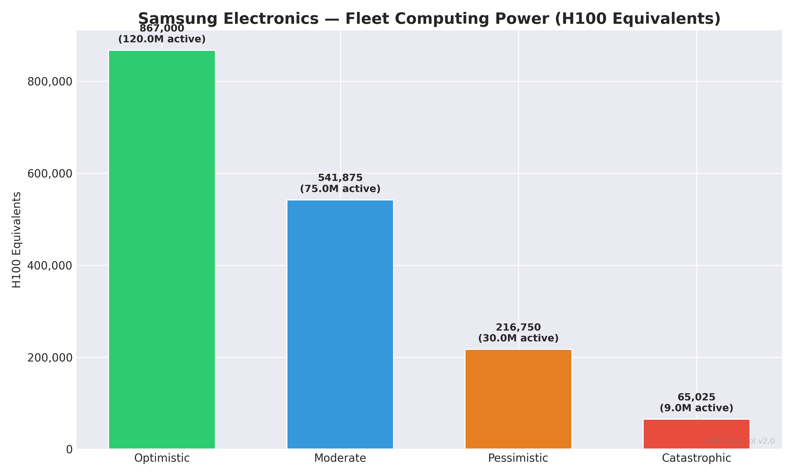
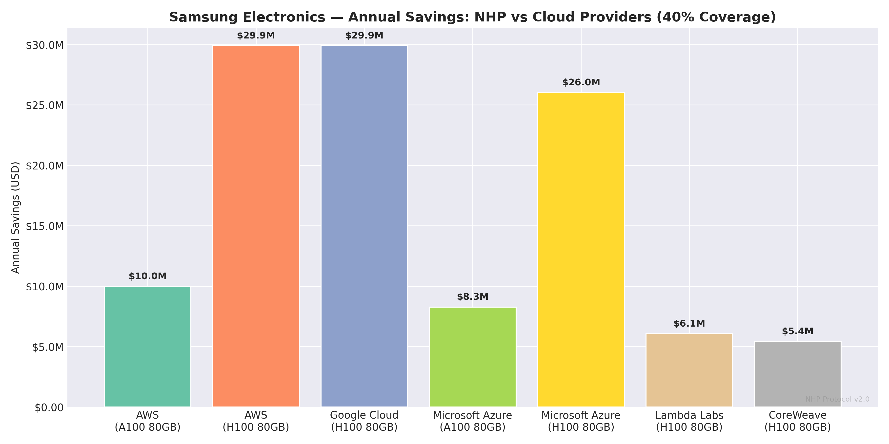
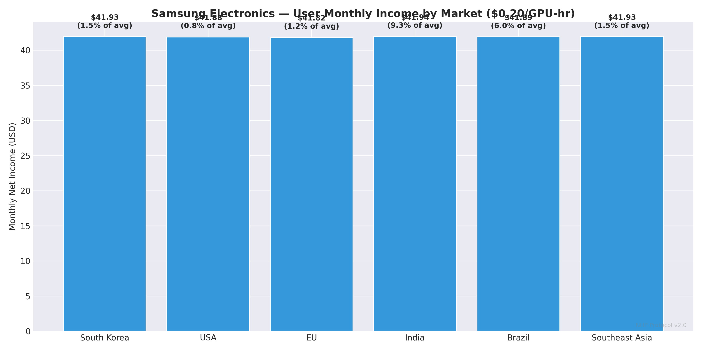
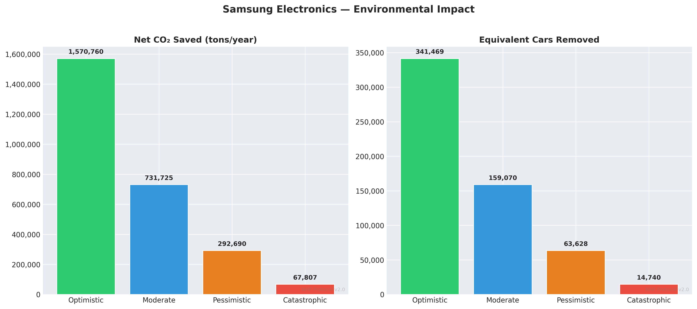
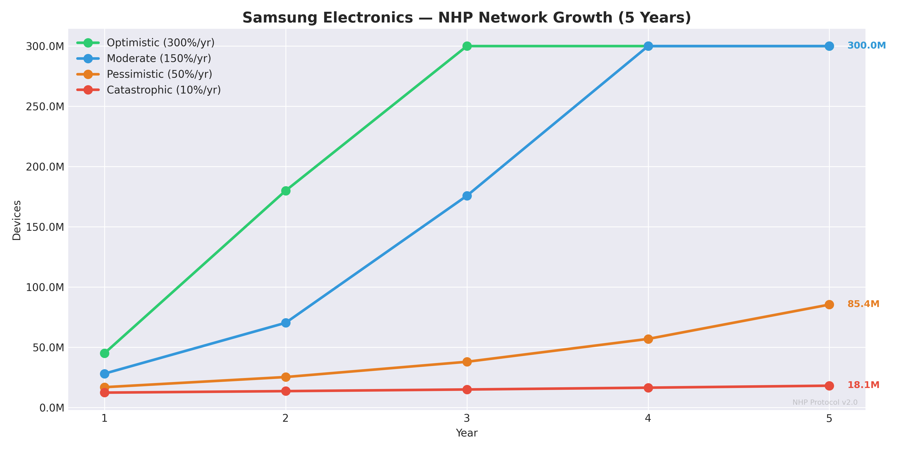
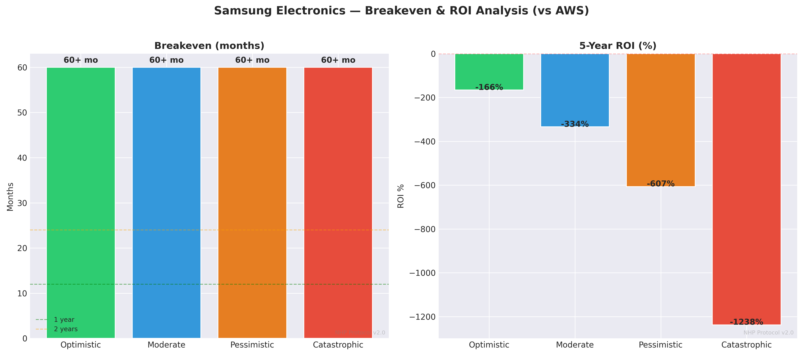

# NHP × Samsung Electronics — Deep Dive Report
# NHP × سامسونج إلكترونيكس — تقرير تفصيلي

**📅 Date: 25.02.2026 | Simulation v2.0**

---

## 1. Company Overview / نبذة عن الشركة

| Field | Value |
|---|---|
| **Name** | Samsung Electronics (سامسونج إلكترونيكس) |
| **Ticker** | 005930.KS |
| **HQ** | South Korea (كوريا الجنوبية) |
| **Founded** | 1969 |
| **CEO** | Jong-Hee Han |
| **Market Cap** | $350B |
| **Annual Revenue** | $210B |
| **Market Share** | 19.4% |
| **Active Devices** | 300M |
| **Annual Sales** | 225M phones/year |
| **Primary OS** | One UI (Android) |
| **Primary Chipset** | Exynos 2400 / Snapdragon 8 Gen 3 |

## 2. Device Fleet Analysis / تحليل أسطول الأجهزة

### Flagship Devices / الأجهزة الرائدة
| Model | Year | GPU | TOPS | RAM | Units (M) |
|---|---|---|---|---|---|
| Galaxy S24 Ultra | 2024 | Snapdragon 8 Gen 3 | 34.0 | 12GB | 10M |
| Galaxy S24+ | 2024 | Exynos 2400 | 34.0 | 12GB | 8M |
| Galaxy S24 | 2024 | Exynos 2400 | 34.0 | 8GB | 15M |
| Galaxy S23 Ultra | 2023 | Snapdragon 8 Gen 2 | 26.0 | 12GB | 12M |
| Galaxy Z Fold5 | 2023 | Snapdragon 8 Gen 2 | 26.0 | 12GB | 5M |

### Mid-Range Devices / الأجهزة المتوسطة
| Model | Year | GPU | TOPS | RAM | Units (M) |
|---|---|---|---|---|---|
| Galaxy A55 | 2024 | Exynos 1480 | 12.0 | 8GB | 30M |
| Galaxy A35 | 2024 | Exynos 1380 | 10.0 | 6GB | 25M |
| Galaxy A15 | 2024 | Helio G99 | 5.0 | 4GB | 40M |

### Fleet Computing Power / القوة الحسابية للأسطول

| Metric | Value |
|---|---|
| Total active devices | 300M |
| Avg flagship TOPS | 30.8 |
| Avg mid-range TOPS | 9.0 |

| Variant | Uptime | Active Devices | Fleet TOPS | H100 Equiv |
|---|---|---|---|---|
| 🟢 Optimistic | 40% | 120,000,000 | 1,734,000,000 | **867,000** |
| 🔵 Moderate | 25% | 75,000,000 | 1,083,750,000 | **541,875** |
| 🟠 Pessimistic | 10% | 30,000,000 | 433,500,000 | **216,750** |
| 🔴 Catastrophic | 3% | 9,000,000 | 130,050,000 | **65,025** |

## 3. Security & TEE Analysis / تحليل الأمان و TEE

| Property | Detail |
|---|---|
| **TEE Name** | Samsung Knox |
| **Description** | Military-grade hardware-backed security platform. Approved by 60+ governments and defense agencies worldwide. Hardware root of trust from chip fabrication. |
| **Maturity** | Mature |
| **Certifications** | CC EAL4+, FIPS 140-2, DISA STIG, CSfC |
| **API Openness** | Restricted |

**TEE Readiness: 🟢 Ready** | **API Access: 🟡 Negotiable**

## 4. AI Services Analysis / تحليل خدمات الذكاء الاصطناعي

### Galaxy AI
- **EN:** On-device and cloud AI for photo editing, translation, summarization, call transcription
- **AR:** ذكاء اصطناعي على الجهاز والسحابة لتحرير الصور والترجمة والتلخيص
- Daily requests: ~500,000,000
- Current cloud: Google Cloud
- Est. annual cloud cost: $500.0M

### Bixby
- **EN:** Voice assistant and device control
- **AR:** مساعد صوتي وتحكم بالجهاز
- Daily requests: ~100,000,000
- Current cloud: Samsung Cloud / AWS
- Est. annual cloud cost: $100.0M

### AI Strategy / استراتيجية AI
- **EN:** Samsung's Galaxy AI is central to their 2024-2026 strategy. They're investing heavily in on-device AI via Exynos NPUs and cloud AI via Google partnership. NHP could reduce their Google Cloud dependency.
- **AR:** Galaxy AI هو محور استراتيجية سامسونج 2024-2026. يستثمرون بكثافة في AI على الجهاز عبر Exynos NPU وفي السحابة عبر شراكة Google. NHP يمكن أن يقلل اعتمادهم على Google Cloud.

## 5. Cost Savings: NHP vs Cloud Providers / التوفير مقارنة بالسحابة

**Total daily AI requests: 600,000,000**
**Total daily GPU hours needed: 16,667**

### vs AWS (A100 80GB)
Annual cloud cost (100%): $24.9M

| Variant | Coverage | Annual Savings | Savings % |
|---|---|---|---|
| 🟢 Optimistic | 70% | **$17.4M** | 70% |
| 🔵 Moderate | 40% | **$10.0M** | 40% |
| 🟠 Pessimistic | 15% | **$3.7M** | 15% |
| 🔴 Catastrophic | 5% | **$1.2M** | 5% |

### vs AWS (H100 80GB)
Annual cloud cost (100%): $74.8M

| Variant | Coverage | Annual Savings | Savings % |
|---|---|---|---|
| 🟢 Optimistic | 70% | **$52.3M** | 70% |
| 🔵 Moderate | 40% | **$29.9M** | 40% |
| 🟠 Pessimistic | 15% | **$11.2M** | 15% |
| 🔴 Catastrophic | 5% | **$3.7M** | 5% |

### vs Google Cloud (H100 80GB)
Annual cloud cost (100%): $74.8M

| Variant | Coverage | Annual Savings | Savings % |
|---|---|---|---|
| 🟢 Optimistic | 70% | **$52.3M** | 70% |
| 🔵 Moderate | 40% | **$29.9M** | 40% |
| 🟠 Pessimistic | 15% | **$11.2M** | 15% |
| 🔴 Catastrophic | 5% | **$3.7M** | 5% |

### vs Microsoft Azure (A100 80GB)
Annual cloud cost (100%): $20.7M

| Variant | Coverage | Annual Savings | Savings % |
|---|---|---|---|
| 🟢 Optimistic | 70% | **$14.5M** | 70% |
| 🔵 Moderate | 40% | **$8.3M** | 40% |
| 🟠 Pessimistic | 15% | **$3.1M** | 15% |
| 🔴 Catastrophic | 5% | **$1.0M** | 5% |

### vs Microsoft Azure (H100 80GB)
Annual cloud cost (100%): $65.1M

| Variant | Coverage | Annual Savings | Savings % |
|---|---|---|---|
| 🟢 Optimistic | 70% | **$45.5M** | 70% |
| 🔵 Moderate | 40% | **$26.0M** | 40% |
| 🟠 Pessimistic | 15% | **$9.8M** | 15% |
| 🔴 Catastrophic | 5% | **$3.3M** | 5% |

### vs Lambda Labs (H100 80GB)
Annual cloud cost (100%): $15.1M

| Variant | Coverage | Annual Savings | Savings % |
|---|---|---|---|
| 🟢 Optimistic | 70% | **$10.6M** | 70% |
| 🔵 Moderate | 40% | **$6.1M** | 40% |
| 🟠 Pessimistic | 15% | **$2.3M** | 15% |
| 🔴 Catastrophic | 5% | **$757K** | 5% |

### vs CoreWeave (H100 80GB)
Annual cloud cost (100%): $13.6M

| Variant | Coverage | Annual Savings | Savings % |
|---|---|---|---|
| 🟢 Optimistic | 70% | **$9.5M** | 70% |
| 🔵 Moderate | 40% | **$5.4M** | 40% |
| 🟠 Pessimistic | 15% | **$2.0M** | 15% |
| 🔴 Catastrophic | 5% | **$678K** | 5% |

## 6. User Income in Primary Markets / دخل المستخدم في الأسواق الرئيسية

| Region | Electricity | Token Price | Monthly Net | Annual Net | % of Avg Income |
|---|---|---|---|---|---|
| South Korea | $0.1/kWh | 🟢 $0.5/hr | $104.93 | $1259.12 | 3.75% |
| South Korea | $0.1/kWh | 🔵 $0.2/hr | $41.93 | $503.12 | 1.50% |
| South Korea | $0.1/kWh | 🟠 $0.08/hr | $16.73 | $200.72 | 0.60% |
| South Korea | $0.1/kWh | 🔴 $0.02/hr | $4.13 | $49.52 | 0.15% |
| USA | $0.16/kWh | 🟢 $0.5/hr | $104.88 | $1258.59 | 1.91% |
| USA | $0.16/kWh | 🔵 $0.2/hr | $41.88 | $502.59 | 0.76% |
| USA | $0.16/kWh | 🟠 $0.08/hr | $16.68 | $200.19 | 0.30% |
| USA | $0.16/kWh | 🔴 $0.02/hr | $4.08 | $48.99 | 0.07% |
| EU (Average) | $0.25/kWh | 🟢 $0.5/hr | $104.82 | $1257.80 | 2.99% |
| EU (Average) | $0.25/kWh | 🔵 $0.2/hr | $41.82 | $501.80 | 1.19% |
| EU (Average) | $0.25/kWh | 🟠 $0.08/hr | $16.62 | $199.40 | 0.47% |
| EU (Average) | $0.25/kWh | 🔴 $0.02/hr | $4.02 | $48.20 | 0.11% |
| India | $0.08/kWh | 🟢 $0.5/hr | $104.94 | $1259.29 | 23.32% |
| India | $0.08/kWh | 🔵 $0.2/hr | $41.94 | $503.29 | 9.32% |
| India | $0.08/kWh | 🟠 $0.08/hr | $16.74 | $200.89 | 3.72% |
| India | $0.08/kWh | 🔴 $0.02/hr | $4.14 | $49.69 | 0.92% |
| Brazil | $0.15/kWh | 🟢 $0.5/hr | $104.89 | $1258.68 | 14.98% |
| Brazil | $0.15/kWh | 🔵 $0.2/hr | $41.89 | $502.68 | 5.98% |
| Brazil | $0.15/kWh | 🟠 $0.08/hr | $16.69 | $200.28 | 2.38% |
| Brazil | $0.15/kWh | 🔴 $0.02/hr | $4.09 | $49.08 | 0.58% |
| South Korea | $0.1/kWh | 🟢 $0.5/hr | $104.93 | $1259.12 | 3.75% |
| South Korea | $0.1/kWh | 🔵 $0.2/hr | $41.93 | $503.12 | 1.50% |
| South Korea | $0.1/kWh | 🟠 $0.08/hr | $16.73 | $200.72 | 0.60% |
| South Korea | $0.1/kWh | 🔴 $0.02/hr | $4.13 | $49.52 | 0.15% |

## 7. Environmental Impact / الأثر البيئي

| Variant | DCs Replaced | CO₂ Saved (net tons) | Cars Removed | Phone CO₂ Added |
|---|---|---|---|---|
| 🟢 Optimistic | 10.0 | **1,570,760** | 341,469 | 429,240 |
| 🔵 Moderate | 5.0 | **731,725** | 159,070 | 268,275 |
| 🟠 Pessimistic | 2.0 | **292,690** | 63,628 | 107,310 |
| 🔴 Catastrophic | 0.5 | **67,807** | 14,740 | 32,193 |

## 8. Network Growth Projection / توقعات نمو الشبكة

Starting point: 11,250,000 devices (5% of annual sales)

| Variant | Growth/yr | Year 1 | Year 2 | Year 3 | Year 4 | Year 5 |
|---|---|---|---|---|---|---|
| 🟢 Optimistic | 300% | 45,000,000 | 180,000,000 | 300,000,000 | 300,000,000 | 300,000,000 |
| 🔵 Moderate | 150% | 28,125,000 | 70,312,500 | 175,781,250 | 300,000,000 | 300,000,000 |
| 🟠 Pessimistic | 50% | 16,875,000 | 25,312,500 | 37,968,750 | 56,953,125 | 85,429,688 |
| 🔴 Catastrophic | 10% | 12,375,000 | 13,612,500 | 14,973,750 | 16,471,125 | 18,118,238 |

## 9. Partnership Assessment / تقييم الشراكة

| Aspect | Assessment |
|---|---|
| **Likelihood** | 🟢 High |
| **Integration Difficulty** | 🟡 Moderate |
| **Est. Integration Time** | 12 months |
| **Est. Integration Cost** | $30M |

### Why Partner? / لماذا الشراكة؟
- **EN:** Samsung already has Knox TEE infrastructure, manufactures their own chips (Exynos), and is actively seeking AI cost reduction. They also have a history of adopting innovative features to compete with Apple.
- **AR:** سامسونج تملك بنية Knox التحتية، تصنّع شرائحها (Exynos)، وتبحث فعلاً عن تقليل تكاليف AI. لديها تاريخ في تبني ميزات مبتكرة للتنافس مع Apple.

### Competitive Advantage / الميزة التنافسية
- **EN:** 'Your Galaxy earns money while you sleep' — a marketing message no competitor can match. Reduces Google Cloud costs. Positions Samsung as leader in distributed AI.
- **AR:** 'جالاكسيك يكسب المال وأنت نايم' — رسالة تسويقية لا يستطيع أي منافس مجاراتها. يقلل تكاليف Google Cloud. يضع سامسونج كرائد في AI الموزع.

### Integration Notes / ملاحظات التكامل
- **EN:** Knox already provides TEE. Key challenge: opening Knox Vault API for NHP without compromising security guarantees. Samsung has internal SDK teams that can facilitate. Exynos NPU SDK exists but is not public.
- **AR:** Knox يوفر TEE جاهزة. التحدي: فتح Knox Vault API لـ NHP دون المساس بالأمان. سامسونج لديها فرق SDK داخلية يمكنها المساعدة. Exynos NPU SDK موجود لكن غير عام.

## 10. Breakeven & ROI Analysis / نقطة التعادل والعائد

| Variant | Coverage | Annual Savings (AWS) | Breakeven | 5yr Net | 5yr ROI |
|---|---|---|---|---|---|
| 🟢 Optimistic | 70% | $17.4M | ∞ | $-62.8M | -209% |
| 🔵 Moderate | 40% | $10.0M | ∞ | $-100.2M | -334% |
| 🟠 Pessimistic | 15% | $3.7M | ∞ | $-131.3M | -438% |
| 🔴 Catastrophic | 5% | $1.2M | ∞ | $-143.8M | -479% |

## 11. Integration Roadmap / خريطة التكامل

**Total estimated time: 12 months**

| Phase | Timeline | Activities EN | الأنشطة AR |
|---|---|---|---|
| 🔵 Phase 1: Research | Month 1-2 | TEE API study, SDK evaluation, security audit | دراسة TEE API، تقييم SDK، تدقيق أمني |
| 🔵 Phase 2: Prototype | Month 3-5 | Build TEE-isolated compute module, test on reference devices | بناء وحدة حوسبة معزولة، اختبار على أجهزة مرجعية |
| 🟡 Phase 3: Integration | Month 6-10 | OS-level integration, manufacturer SDK collaboration | تكامل على مستوى النظام، تعاون مع SDK المصنّع |
| 🟢 Phase 4: Testing | Month 11-12 | Beta testing with real users, performance benchmarks | اختبار تجريبي مع مستخدمين حقيقيين، قياس الأداء |
| 🚀 Phase 5: Launch | Month 12+ | OTA update rollout, monitoring, optimization | إطلاق عبر التحديثات، مراقبة، تحسين |

## 12. Company-Specific Risks / مخاطر خاصة بالشركة

| Risk EN | Risk AR | Probability | Impact | Mitigation EN | التخفيف AR |
|---|---|---|---|---|---|
| Partnership rejection | رفض الشراكة | Medium | 🔴 Critical | Prepare compelling data, approach multiple contacts, offer pilot program | تحضير بيانات مقنعة، التواصل مع عدة جهات، عرض برنامج تجريبي |
| Samsung Knox API access denied | رفض الوصول لـ Samsung Knox API | High | 🔴 Critical | Propose co-development, sign NDA, offer security audit | اقتراح تطوير مشترك، توقيع NDA، عرض تدقيق أمني |
| User privacy concerns | مخاوف خصوصية المستخدم | Medium | 🟠 High | TEE guarantees isolation, transparent communication, opt-in only | TEE يضمن العزل، تواصل شفاف، اشتراك اختياري فقط |
| Battery degradation complaints | شكاوى تدهور البطارية | Medium | 🟡 Medium | Limit to charging+WiFi, publish transparent battery impact data | تحديد التشغيل أثناء الشحن فقط، نشر بيانات شفافة عن تأثير البطارية |
| Regulatory issues in South Korea | مشاكل تنظيمية في كوريا الجنوبية | Low | 🟠 High | Legal review before launch, compliance framework, local counsel | مراجعة قانونية قبل الإطلاق، إطار امتثال، مستشار محلي |

## 13. Primary Markets / الأسواق الرئيسية

- 🌍 South Korea (كوريا الجنوبية)
- 🌍 USA (الولايات المتحدة)
- 🌍 EU (أوروبا)
- 🌍 India (الهند)
- 🌍 Brazil (البرازيل)
- 🌍 Southeast Asia (جنوب شرق آسيا)

---

*NHP × Samsung Electronics Deep Dive — Generated 25.02.2026*
*الحوسبة في يد الجميع — Computing in Everyone's Hands*