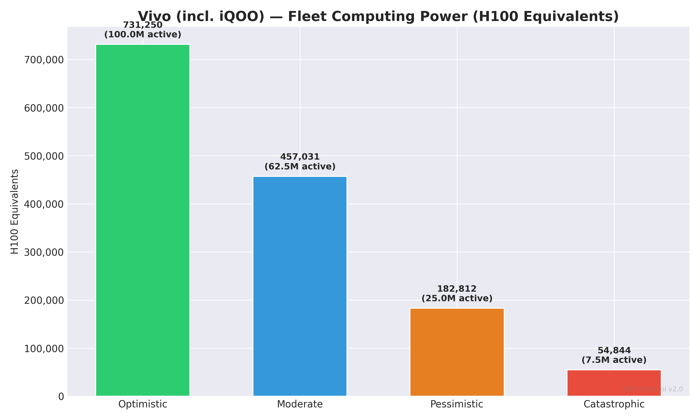
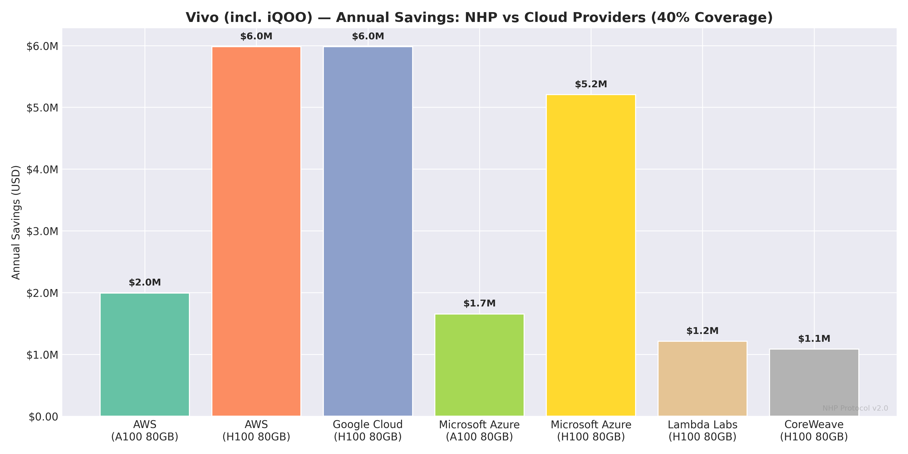
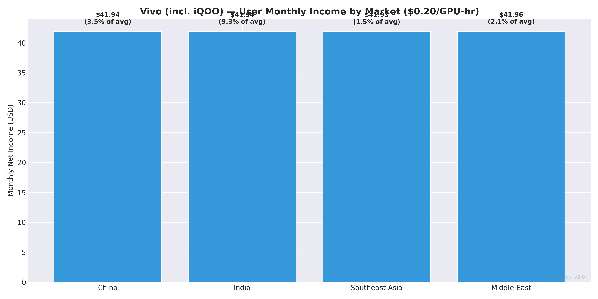
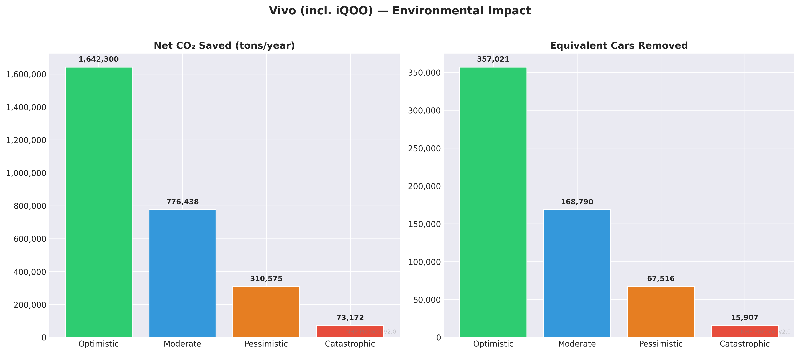
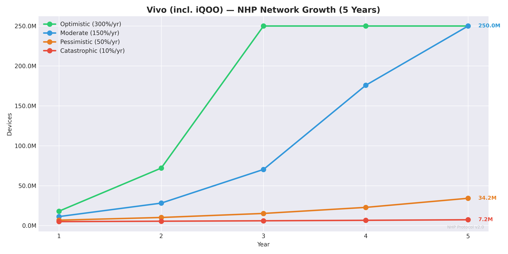
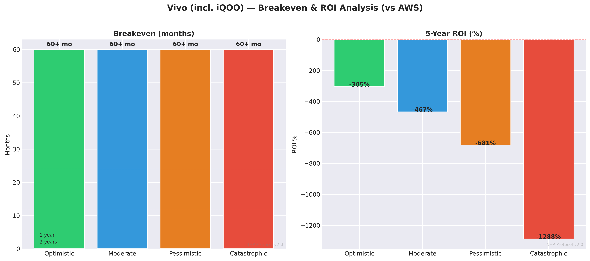

# NHP × Vivo (incl. iQOO) — Deep Dive Report
# NHP × فيفو (ومنها iQOO) — تقرير تفصيلي

**📅 Date: 25.02.2026 | Simulation v2.0**

---

## 1. Company Overview / نبذة عن الشركة

| Field | Value |
|---|---|
| **Name** | Vivo (incl. iQOO) (فيفو (ومنها iQOO)) |
| **Ticker** | Private (BBK) |
| **HQ** | China (الصين) |
| **Founded** | 2009 |
| **CEO** | Shen Wei |
| **Market Cap** | Private |
| **Annual Revenue** | $13B |
| **Market Share** | 7.5% |
| **Active Devices** | 250M |
| **Annual Sales** | 90M phones/year |
| **Primary OS** | OriginOS / Funtouch OS (Android) |
| **Primary Chipset** | Snapdragon 8 Gen 3 / Dimensity 9200+ |

## 2. Device Fleet Analysis / تحليل أسطول الأجهزة

### Flagship Devices / الأجهزة الرائدة
| Model | Year | GPU | TOPS | RAM | Units (M) |
|---|---|---|---|---|---|
| Vivo X100 Pro | 2024 | Dimensity 9300 | 35.0 | 16GB | 3M |
| iQOO 12 | 2024 | Snapdragon 8 Gen 3 | 34.0 | 12GB | 4M |

### Mid-Range Devices / الأجهزة المتوسطة
| Model | Year | GPU | TOPS | RAM | Units (M) |
|---|---|---|---|---|---|
| Vivo Y200 | 2024 | Snapdragon 4 Gen 2 | 6.0 | 8GB | 20M |
| Vivo T3 | 2024 | Dimensity 7200 | 10.0 | 8GB | 15M |

### Fleet Computing Power / القوة الحسابية للأسطول

| Metric | Value |
|---|---|
| Total active devices | 250M |
| Avg flagship TOPS | 34.5 |
| Avg mid-range TOPS | 8.0 |

| Variant | Uptime | Active Devices | Fleet TOPS | H100 Equiv |
|---|---|---|---|---|
| 🟢 Optimistic | 40% | 100,000,000 | 1,462,500,000 | **731,250** |
| 🔵 Moderate | 25% | 62,500,000 | 914,062,500 | **457,031** |
| 🟠 Pessimistic | 10% | 25,000,000 | 365,625,000 | **182,812** |
| 🔴 Catastrophic | 3% | 7,500,000 | 109,687,500 | **54,844** |

## 3. Security & TEE Analysis / تحليل الأمان و TEE

| Property | Detail |
|---|---|
| **TEE Name** | Qualcomm QTEE / MediaTek TEE |
| **Description** | Standard chipset TEE with Vivo's OriginOS security additions. |
| **Maturity** | Developing |
| **Certifications** | CC EAL2 |
| **API Openness** | Open |

**TEE Readiness: 🟡 Needs work** | **API Access: 🟢 Easy**

## 4. AI Services Analysis / تحليل خدمات الذكاء الاصطناعي

### OriginOS AI
- **EN:** Camera AI, system optimization, smart features
- **AR:** AI الكاميرا، تحسين النظام، ميزات ذكية
- Daily requests: ~120,000,000
- Current cloud: Tencent Cloud / Huawei Cloud
- Est. annual cloud cost: $80.0M

### AI Strategy / استراتيجية AI
- **EN:** Vivo focuses on camera excellence and mid-range domination in India. Part of BBK group. An NHP partnership with Vivo opens the door to the Indian sub-continent's massive smartphone base.
- **AR:** فيفو تركز على تفوق الكاميرا والهيمنة على الفئة المتوسطة في الهند. جزء من مجموعة BBK. شراكة مع فيفو تفتح سوق الهند الضخم.

## 5. Cost Savings: NHP vs Cloud Providers / التوفير مقارنة بالسحابة

**Total daily AI requests: 120,000,000**
**Total daily GPU hours needed: 3,333**

### vs AWS (A100 80GB)
Annual cloud cost (100%): $5.0M

| Variant | Coverage | Annual Savings | Savings % |
|---|---|---|---|
| 🟢 Optimistic | 70% | **$3.5M** | 70% |
| 🔵 Moderate | 40% | **$2.0M** | 40% |
| 🟠 Pessimistic | 15% | **$748K** | 15% |
| 🔴 Catastrophic | 5% | **$249K** | 5% |

### vs AWS (H100 80GB)
Annual cloud cost (100%): $15.0M

| Variant | Coverage | Annual Savings | Savings % |
|---|---|---|---|
| 🟢 Optimistic | 70% | **$10.5M** | 70% |
| 🔵 Moderate | 40% | **$6.0M** | 40% |
| 🟠 Pessimistic | 15% | **$2.2M** | 15% |
| 🔴 Catastrophic | 5% | **$748K** | 5% |

### vs Google Cloud (H100 80GB)
Annual cloud cost (100%): $15.0M

| Variant | Coverage | Annual Savings | Savings % |
|---|---|---|---|
| 🟢 Optimistic | 70% | **$10.5M** | 70% |
| 🔵 Moderate | 40% | **$6.0M** | 40% |
| 🟠 Pessimistic | 15% | **$2.2M** | 15% |
| 🔴 Catastrophic | 5% | **$748K** | 5% |

### vs Microsoft Azure (A100 80GB)
Annual cloud cost (100%): $4.1M

| Variant | Coverage | Annual Savings | Savings % |
|---|---|---|---|
| 🟢 Optimistic | 70% | **$2.9M** | 70% |
| 🔵 Moderate | 40% | **$1.7M** | 40% |
| 🟠 Pessimistic | 15% | **$620K** | 15% |
| 🔴 Catastrophic | 5% | **$207K** | 5% |

### vs Microsoft Azure (H100 80GB)
Annual cloud cost (100%): $13.0M

| Variant | Coverage | Annual Savings | Savings % |
|---|---|---|---|
| 🟢 Optimistic | 70% | **$9.1M** | 70% |
| 🔵 Moderate | 40% | **$5.2M** | 40% |
| 🟠 Pessimistic | 15% | **$2.0M** | 15% |
| 🔴 Catastrophic | 5% | **$651K** | 5% |

### vs Lambda Labs (H100 80GB)
Annual cloud cost (100%): $3.0M

| Variant | Coverage | Annual Savings | Savings % |
|---|---|---|---|
| 🟢 Optimistic | 70% | **$2.1M** | 70% |
| 🔵 Moderate | 40% | **$1.2M** | 40% |
| 🟠 Pessimistic | 15% | **$454K** | 15% |
| 🔴 Catastrophic | 5% | **$151K** | 5% |

### vs CoreWeave (H100 80GB)
Annual cloud cost (100%): $2.7M

| Variant | Coverage | Annual Savings | Savings % |
|---|---|---|---|
| 🟢 Optimistic | 70% | **$1.9M** | 70% |
| 🔵 Moderate | 40% | **$1.1M** | 40% |
| 🟠 Pessimistic | 15% | **$407K** | 15% |
| 🔴 Catastrophic | 5% | **$136K** | 5% |

## 6. User Income in Primary Markets / دخل المستخدم في الأسواق الرئيسية

| Region | Electricity | Token Price | Monthly Net | Annual Net | % of Avg Income |
|---|---|---|---|---|---|
| China | $0.08/kWh | 🟢 $0.5/hr | $104.94 | $1259.29 | 8.75% |
| China | $0.08/kWh | 🔵 $0.2/hr | $41.94 | $503.29 | 3.50% |
| China | $0.08/kWh | 🟠 $0.08/hr | $16.74 | $200.89 | 1.40% |
| China | $0.08/kWh | 🔴 $0.02/hr | $4.14 | $49.69 | 0.35% |
| India | $0.08/kWh | 🟢 $0.5/hr | $104.94 | $1259.29 | 23.32% |
| India | $0.08/kWh | 🔵 $0.2/hr | $41.94 | $503.29 | 9.32% |
| India | $0.08/kWh | 🟠 $0.08/hr | $16.74 | $200.89 | 3.72% |
| India | $0.08/kWh | 🔴 $0.02/hr | $4.14 | $49.69 | 0.92% |
| South Korea | $0.1/kWh | 🟢 $0.5/hr | $104.93 | $1259.12 | 3.75% |
| South Korea | $0.1/kWh | 🔵 $0.2/hr | $41.93 | $503.12 | 1.50% |
| South Korea | $0.1/kWh | 🟠 $0.08/hr | $16.73 | $200.72 | 0.60% |
| South Korea | $0.1/kWh | 🔴 $0.02/hr | $4.13 | $49.52 | 0.15% |
| Middle East | $0.05/kWh | 🟢 $0.5/hr | $104.96 | $1259.56 | 5.25% |
| Middle East | $0.05/kWh | 🔵 $0.2/hr | $41.96 | $503.56 | 2.10% |
| Middle East | $0.05/kWh | 🟠 $0.08/hr | $16.76 | $201.16 | 0.84% |
| Middle East | $0.05/kWh | 🔴 $0.02/hr | $4.16 | $49.96 | 0.21% |

## 7. Environmental Impact / الأثر البيئي

| Variant | DCs Replaced | CO₂ Saved (net tons) | Cars Removed | Phone CO₂ Added |
|---|---|---|---|---|
| 🟢 Optimistic | 10.0 | **1,642,300** | 357,021 | 357,700 |
| 🔵 Moderate | 5.0 | **776,438** | 168,790 | 223,562 |
| 🟠 Pessimistic | 2.0 | **310,575** | 67,516 | 89,425 |
| 🔴 Catastrophic | 0.5 | **73,172** | 15,907 | 26,828 |

## 8. Network Growth Projection / توقعات نمو الشبكة

Starting point: 4,500,000 devices (5% of annual sales)

| Variant | Growth/yr | Year 1 | Year 2 | Year 3 | Year 4 | Year 5 |
|---|---|---|---|---|---|---|
| 🟢 Optimistic | 300% | 18,000,000 | 72,000,000 | 250,000,000 | 250,000,000 | 250,000,000 |
| 🔵 Moderate | 150% | 11,250,000 | 28,125,000 | 70,312,500 | 175,781,250 | 250,000,000 |
| 🟠 Pessimistic | 50% | 6,750,000 | 10,125,000 | 15,187,500 | 22,781,250 | 34,171,875 |
| 🔴 Catastrophic | 10% | 4,950,000 | 5,445,000 | 5,989,500 | 6,588,450 | 7,247,295 |

## 9. Partnership Assessment / تقييم الشراكة

| Aspect | Assessment |
|---|---|
| **Likelihood** | 🟡 Medium |
| **Integration Difficulty** | 🟢 Easy |
| **Est. Integration Time** | 8 months |
| **Est. Integration Cost** | $12M |

### Why Partner? / لماذا الشراكة؟
- **EN:** Same BBK group as OPPO. Strong India presence. Needs differentiation in a crowded market. NHP passive income feature is powerful in price-sensitive markets.
- **AR:** نفس مجموعة BBK مع أوبو. تواجد قوي بالهند. تحتاج تمايز في سوق مزدحم. ميزة الدخل السلبي قوية في الأسواق الحساسة للسعر.

### Competitive Advantage / الميزة التنافسية
- **EN:** BBK group access. #1 in India by volume some quarters. Price-sensitive markets where passive income matters most.
- **AR:** وصول لمجموعة BBK. الأولى بالهند في بعض الأرباع. أسواق حساسة للسعر حيث الدخل السلبي هو الأهم.

### Integration Notes / ملاحظات التكامل
- **EN:** Identical technical stack to OPPO (same parent company). Integration done for one BBK brand directly transfers to others.
- **AR:** حزمة تقنية مطابقة لأوبو (نفس الشركة الأم). التكامل لعلامة BBK واحدة ينتقل مباشرة للبقية.

## 10. Breakeven & ROI Analysis / نقطة التعادل والعائد

| Variant | Coverage | Annual Savings (AWS) | Breakeven | 5yr Net | 5yr ROI |
|---|---|---|---|---|---|
| 🟢 Optimistic | 70% | $3.5M | ∞ | $-114.6M | -955% |
| 🔵 Moderate | 40% | $2.0M | ∞ | $-122.0M | -1017% |
| 🟠 Pessimistic | 15% | $748K | ∞ | $-128.3M | -1069% |
| 🔴 Catastrophic | 5% | $249K | ∞ | $-130.8M | -1090% |

## 11. Integration Roadmap / خريطة التكامل

**Total estimated time: 8 months**

| Phase | Timeline | Activities EN | الأنشطة AR |
|---|---|---|---|
| 🔵 Phase 1: Research | Month 1-2 | TEE API study, SDK evaluation, security audit | دراسة TEE API، تقييم SDK، تدقيق أمني |
| 🔵 Phase 2: Prototype | Month 3-4 | Build TEE-isolated compute module, test on reference devices | بناء وحدة حوسبة معزولة، اختبار على أجهزة مرجعية |
| 🟡 Phase 3: Integration | Month 5-6 | OS-level integration, manufacturer SDK collaboration | تكامل على مستوى النظام، تعاون مع SDK المصنّع |
| 🟢 Phase 4: Testing | Month 7-8 | Beta testing with real users, performance benchmarks | اختبار تجريبي مع مستخدمين حقيقيين، قياس الأداء |
| 🚀 Phase 5: Launch | Month 8+ | OTA update rollout, monitoring, optimization | إطلاق عبر التحديثات، مراقبة، تحسين |

## 12. Company-Specific Risks / مخاطر خاصة بالشركة

| Risk EN | Risk AR | Probability | Impact | Mitigation EN | التخفيف AR |
|---|---|---|---|---|---|
| Partnership rejection | رفض الشراكة | High | 🔴 Critical | Prepare compelling data, approach multiple contacts, offer pilot program | تحضير بيانات مقنعة، التواصل مع عدة جهات، عرض برنامج تجريبي |
| Qualcomm QTEE / MediaTek TEE API access denied | رفض الوصول لـ Qualcomm QTEE / MediaTek TEE API | Low | 🔴 Critical | Propose co-development, sign NDA, offer security audit | اقتراح تطوير مشترك، توقيع NDA، عرض تدقيق أمني |
| User privacy concerns | مخاوف خصوصية المستخدم | Medium | 🟠 High | TEE guarantees isolation, transparent communication, opt-in only | TEE يضمن العزل، تواصل شفاف، اشتراك اختياري فقط |
| Battery degradation complaints | شكاوى تدهور البطارية | Medium | 🟡 Medium | Limit to charging+WiFi, publish transparent battery impact data | تحديد التشغيل أثناء الشحن فقط، نشر بيانات شفافة عن تأثير البطارية |
| Regulatory issues in China | مشاكل تنظيمية في الصين | Low | 🟠 High | Legal review before launch, compliance framework, local counsel | مراجعة قانونية قبل الإطلاق، إطار امتثال، مستشار محلي |

## 13. Primary Markets / الأسواق الرئيسية

- 🌍 China (الصين)
- 🌍 India (الهند)
- 🌍 Southeast Asia (جنوب شرق آسيا)
- 🌍 Middle East (الشرق الأوسط)

---

*NHP × Vivo (incl. iQOO) Deep Dive — Generated 25.02.2026*
*الحوسبة في يد الجميع — Computing in Everyone's Hands*