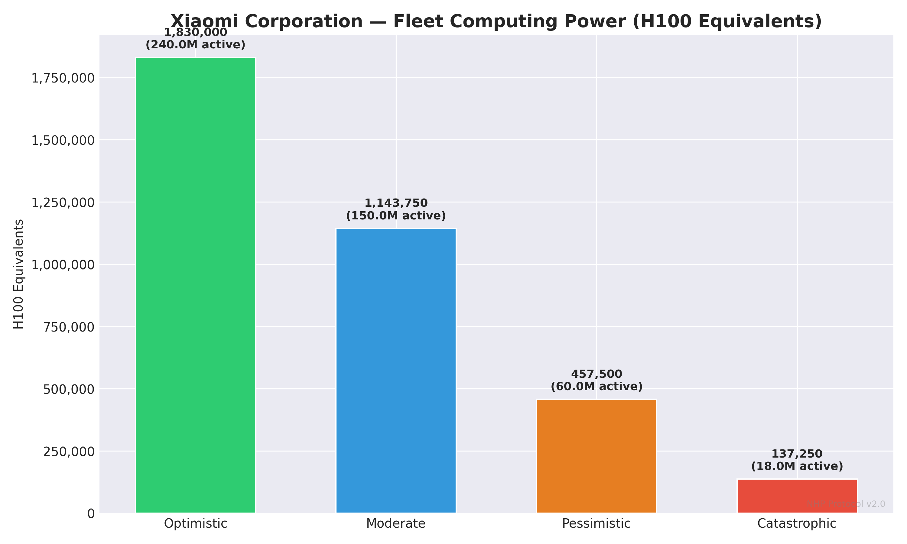
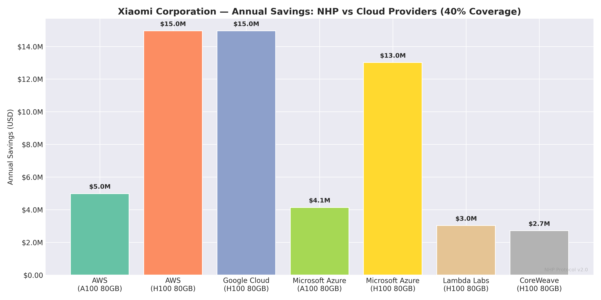
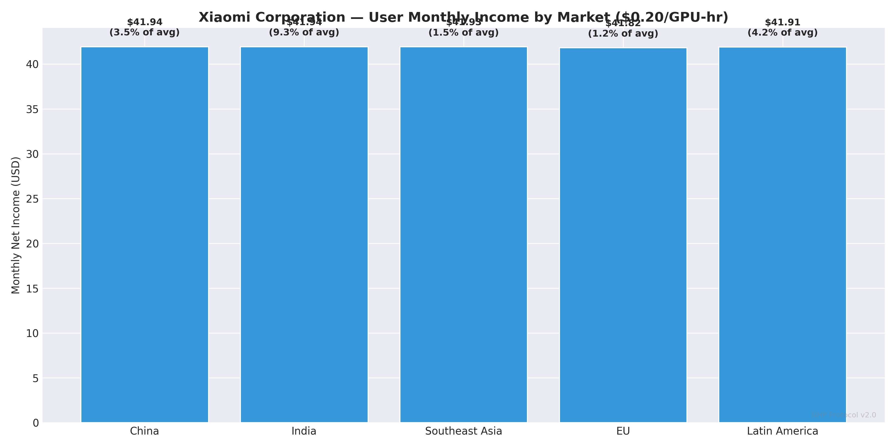
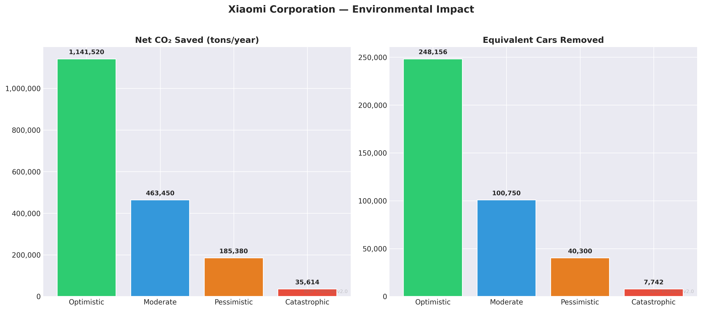
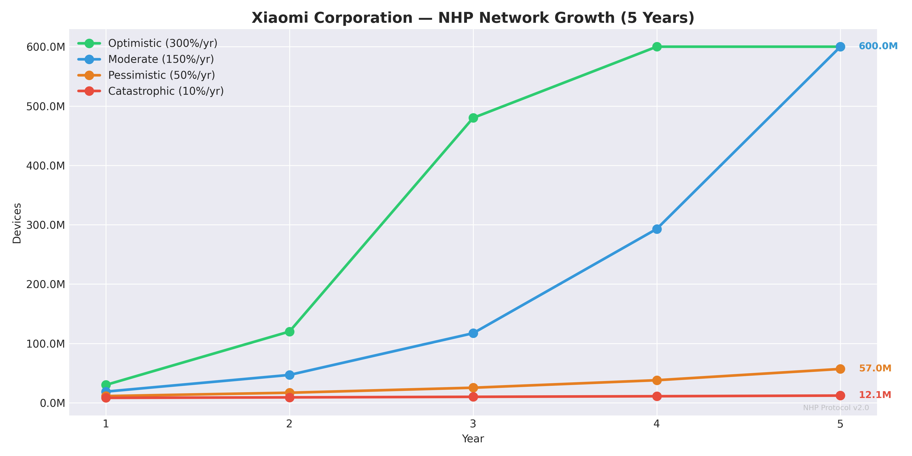
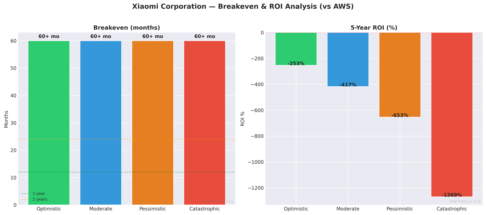

# NHP × Xiaomi Corporation — Deep Dive Report
# NHP × شاومي — تقرير تفصيلي

**📅 Date: 25.02.2026 | Simulation v2.0**

---

## 1. Company Overview / نبذة عن الشركة

| Field | Value |
|---|---|
| **Name** | Xiaomi Corporation (شاومي) |
| **Ticker** | 1810.HK |
| **HQ** | China (الصين) |
| **Founded** | 2010 |
| **CEO** | Lei Jun |
| **Market Cap** | $110B |
| **Annual Revenue** | $37B |
| **Market Share** | 12.5% |
| **Active Devices** | 600M |
| **Annual Sales** | 150M phones/year |
| **Primary OS** | HyperOS (Android) |
| **Primary Chipset** | Snapdragon 8 Gen 3 |

## 2. Device Fleet Analysis / تحليل أسطول الأجهزة

### Flagship Devices / الأجهزة الرائدة
| Model | Year | GPU | TOPS | RAM | Units (M) |
|---|---|---|---|---|---|
| Xiaomi 14 Ultra | 2024 | Snapdragon 8 Gen 3 | 34.0 | 16GB | 3M |
| Xiaomi 14 Pro | 2024 | Snapdragon 8 Gen 3 | 34.0 | 12GB | 5M |
| Xiaomi 14 | 2024 | Snapdragon 8 Gen 3 | 34.0 | 12GB | 10M |

### Mid-Range Devices / الأجهزة المتوسطة
| Model | Year | GPU | TOPS | RAM | Units (M) |
|---|---|---|---|---|---|
| Redmi Note 13 Pro+ | 2024 | Dimensity 7200 | 10.0 | 8GB | 30M |
| Redmi Note 13 | 2024 | Snapdragon 685 | 5.0 | 6GB | 50M |
| POCO X6 Pro | 2024 | Dimensity 8300 | 12.0 | 8GB | 15M |

### Fleet Computing Power / القوة الحسابية للأسطول

| Metric | Value |
|---|---|
| Total active devices | 600M |
| Avg flagship TOPS | 34.0 |
| Avg mid-range TOPS | 9.0 |

| Variant | Uptime | Active Devices | Fleet TOPS | H100 Equiv |
|---|---|---|---|---|
| 🟢 Optimistic | 40% | 240,000,000 | 3,660,000,000 | **1,830,000** |
| 🔵 Moderate | 25% | 150,000,000 | 2,287,500,000 | **1,143,750** |
| 🟠 Pessimistic | 10% | 60,000,000 | 915,000,000 | **457,500** |
| 🔴 Catastrophic | 3% | 18,000,000 | 274,500,000 | **137,250** |

## 3. Security & TEE Analysis / تحليل الأمان و TEE

| Property | Detail |
|---|---|
| **TEE Name** | Qualcomm TEE / Xiaomi Security |
| **Description** | Relies on Qualcomm's QTEE for Snapdragon devices and MediaTek TEE for Dimensity. Xiaomi adds its own security layer via HyperOS. |
| **Maturity** | Developing |
| **Certifications** | CC EAL2, China CCRA |
| **API Openness** | Open |

**TEE Readiness: 🟡 Needs work** | **API Access: 🟢 Easy**

## 4. AI Services Analysis / تحليل خدمات الذكاء الاصطناعي

### HyperOS AI
- **EN:** Smart home integration, camera AI, on-device assistant
- **AR:** تكامل المنزل الذكي، AI الكاميرا، مساعد على الجهاز
- Daily requests: ~300,000,000
- Current cloud: Alibaba Cloud / Tencent Cloud
- Est. annual cloud cost: $200.0M

### AI Strategy / استراتيجية AI
- **EN:** Xiaomi is aggressively expanding AI across HyperOS and its IoT ecosystem. They have 600M+ connected devices. Their open-source philosophy and hunger for differentiation make them an ideal NHP partner.
- **AR:** شاومي توسع AI بقوة عبر HyperOS ونظام IoT الخاص بها. لديها 600M+ جهاز متصل. فلسفتها المفتوحة وشغفها بالتمايز يجعلانها شريكاً مثالياً لـ NHP.

## 5. Cost Savings: NHP vs Cloud Providers / التوفير مقارنة بالسحابة

**Total daily AI requests: 300,000,000**
**Total daily GPU hours needed: 8,333**

### vs AWS (A100 80GB)
Annual cloud cost (100%): $12.5M

| Variant | Coverage | Annual Savings | Savings % |
|---|---|---|---|
| 🟢 Optimistic | 70% | **$8.7M** | 70% |
| 🔵 Moderate | 40% | **$5.0M** | 40% |
| 🟠 Pessimistic | 15% | **$1.9M** | 15% |
| 🔴 Catastrophic | 5% | **$623K** | 5% |

### vs AWS (H100 80GB)
Annual cloud cost (100%): $37.4M

| Variant | Coverage | Annual Savings | Savings % |
|---|---|---|---|
| 🟢 Optimistic | 70% | **$26.2M** | 70% |
| 🔵 Moderate | 40% | **$15.0M** | 40% |
| 🟠 Pessimistic | 15% | **$5.6M** | 15% |
| 🔴 Catastrophic | 5% | **$1.9M** | 5% |

### vs Google Cloud (H100 80GB)
Annual cloud cost (100%): $37.4M

| Variant | Coverage | Annual Savings | Savings % |
|---|---|---|---|
| 🟢 Optimistic | 70% | **$26.2M** | 70% |
| 🔵 Moderate | 40% | **$15.0M** | 40% |
| 🟠 Pessimistic | 15% | **$5.6M** | 15% |
| 🔴 Catastrophic | 5% | **$1.9M** | 5% |

### vs Microsoft Azure (A100 80GB)
Annual cloud cost (100%): $10.3M

| Variant | Coverage | Annual Savings | Savings % |
|---|---|---|---|
| 🟢 Optimistic | 70% | **$7.2M** | 70% |
| 🔵 Moderate | 40% | **$4.1M** | 40% |
| 🟠 Pessimistic | 15% | **$1.6M** | 15% |
| 🔴 Catastrophic | 5% | **$517K** | 5% |

### vs Microsoft Azure (H100 80GB)
Annual cloud cost (100%): $32.5M

| Variant | Coverage | Annual Savings | Savings % |
|---|---|---|---|
| 🟢 Optimistic | 70% | **$22.8M** | 70% |
| 🔵 Moderate | 40% | **$13.0M** | 40% |
| 🟠 Pessimistic | 15% | **$4.9M** | 15% |
| 🔴 Catastrophic | 5% | **$1.6M** | 5% |

### vs Lambda Labs (H100 80GB)
Annual cloud cost (100%): $7.6M

| Variant | Coverage | Annual Savings | Savings % |
|---|---|---|---|
| 🟢 Optimistic | 70% | **$5.3M** | 70% |
| 🔵 Moderate | 40% | **$3.0M** | 40% |
| 🟠 Pessimistic | 15% | **$1.1M** | 15% |
| 🔴 Catastrophic | 5% | **$379K** | 5% |

### vs CoreWeave (H100 80GB)
Annual cloud cost (100%): $6.8M

| Variant | Coverage | Annual Savings | Savings % |
|---|---|---|---|
| 🟢 Optimistic | 70% | **$4.7M** | 70% |
| 🔵 Moderate | 40% | **$2.7M** | 40% |
| 🟠 Pessimistic | 15% | **$1.0M** | 15% |
| 🔴 Catastrophic | 5% | **$339K** | 5% |

## 6. User Income in Primary Markets / دخل المستخدم في الأسواق الرئيسية

| Region | Electricity | Token Price | Monthly Net | Annual Net | % of Avg Income |
|---|---|---|---|---|---|
| China | $0.08/kWh | 🟢 $0.5/hr | $104.94 | $1259.29 | 8.75% |
| China | $0.08/kWh | 🔵 $0.2/hr | $41.94 | $503.29 | 3.50% |
| China | $0.08/kWh | 🟠 $0.08/hr | $16.74 | $200.89 | 1.40% |
| China | $0.08/kWh | 🔴 $0.02/hr | $4.14 | $49.69 | 0.35% |
| India | $0.08/kWh | 🟢 $0.5/hr | $104.94 | $1259.29 | 23.32% |
| India | $0.08/kWh | 🔵 $0.2/hr | $41.94 | $503.29 | 9.32% |
| India | $0.08/kWh | 🟠 $0.08/hr | $16.74 | $200.89 | 3.72% |
| India | $0.08/kWh | 🔴 $0.02/hr | $4.14 | $49.69 | 0.92% |
| South Korea | $0.1/kWh | 🟢 $0.5/hr | $104.93 | $1259.12 | 3.75% |
| South Korea | $0.1/kWh | 🔵 $0.2/hr | $41.93 | $503.12 | 1.50% |
| South Korea | $0.1/kWh | 🟠 $0.08/hr | $16.73 | $200.72 | 0.60% |
| South Korea | $0.1/kWh | 🔴 $0.02/hr | $4.13 | $49.52 | 0.15% |
| EU (Average) | $0.25/kWh | 🟢 $0.5/hr | $104.82 | $1257.80 | 2.99% |
| EU (Average) | $0.25/kWh | 🔵 $0.2/hr | $41.82 | $501.80 | 1.19% |
| EU (Average) | $0.25/kWh | 🟠 $0.08/hr | $16.62 | $199.40 | 0.47% |
| EU (Average) | $0.25/kWh | 🔴 $0.02/hr | $4.02 | $48.20 | 0.11% |
| Latin America | $0.12/kWh | 🟢 $0.5/hr | $104.91 | $1258.94 | 10.49% |
| Latin America | $0.12/kWh | 🔵 $0.2/hr | $41.91 | $502.94 | 4.19% |
| Latin America | $0.12/kWh | 🟠 $0.08/hr | $16.71 | $200.54 | 1.67% |
| Latin America | $0.12/kWh | 🔴 $0.02/hr | $4.11 | $49.34 | 0.41% |

## 7. Environmental Impact / الأثر البيئي

| Variant | DCs Replaced | CO₂ Saved (net tons) | Cars Removed | Phone CO₂ Added |
|---|---|---|---|---|
| 🟢 Optimistic | 10.0 | **1,141,520** | 248,156 | 858,480 |
| 🔵 Moderate | 5.0 | **463,450** | 100,750 | 536,550 |
| 🟠 Pessimistic | 2.0 | **185,380** | 40,300 | 214,620 |
| 🔴 Catastrophic | 0.5 | **35,614** | 7,742 | 64,386 |

## 8. Network Growth Projection / توقعات نمو الشبكة

Starting point: 7,500,000 devices (5% of annual sales)

| Variant | Growth/yr | Year 1 | Year 2 | Year 3 | Year 4 | Year 5 |
|---|---|---|---|---|---|---|
| 🟢 Optimistic | 300% | 30,000,000 | 120,000,000 | 480,000,000 | 600,000,000 | 600,000,000 |
| 🔵 Moderate | 150% | 18,750,000 | 46,875,000 | 117,187,500 | 292,968,750 | 600,000,000 |
| 🟠 Pessimistic | 50% | 11,250,000 | 16,875,000 | 25,312,500 | 37,968,750 | 56,953,125 |
| 🔴 Catastrophic | 10% | 8,250,000 | 9,075,000 | 9,982,500 | 10,980,750 | 12,078,825 |

## 9. Partnership Assessment / تقييم الشراكة

| Aspect | Assessment |
|---|---|
| **Likelihood** | 🟢 High |
| **Integration Difficulty** | 🟢 Easy |
| **Est. Integration Time** | 8 months |
| **Est. Integration Cost** | $15M |

### Why Partner? / لماذا الشراكة؟
- **EN:** Xiaomi has the most open ecosystem among major manufacturers. They actively seek innovative features to compete with Samsung/Apple. Their massive presence in emerging markets (India, SEA) where $42/month passive income is life-changing makes NHP extremely attractive.
- **AR:** شاومي لديها النظام الأكثر انفتاحاً. تبحث بنشاط عن ميزات مبتكرة للتنافس. تواجدها الضخم في الأسواق الناشئة حيث $42/شهر يغير حياة المستخدم يجعل NHP جذاباً للغاية.

### Competitive Advantage / الميزة التنافسية
- **EN:** Massive emerging market presence where passive income matters most. Open ecosystem enables faster integration. 600M+ IoT devices could extend NHP beyond phones.
- **AR:** تواجد ضخم في الأسواق الناشئة حيث الدخل السلبي أكثر أهمية. النظام المفتوح يسرع التكامل. 600M+ جهاز IoT يمكن أن يوسع NHP.

### Integration Notes / ملاحظات التكامل
- **EN:** Qualcomm TEE is well-documented. HyperOS is Android-based with more developer freedom than Samsung/Apple. Xiaomi's developer community is active and supportive. Could integrate in 6-8 months.
- **AR:** Qualcomm TEE موثق جيداً. HyperOS مبني على Android مع حرية أكبر للمطورين. مجتمع مطوري شاومي نشط وداعم. يمكن التكامل في 6-8 أشهر.

## 10. Breakeven & ROI Analysis / نقطة التعادل والعائد

| Variant | Coverage | Annual Savings (AWS) | Breakeven | 5yr Net | 5yr ROI |
|---|---|---|---|---|---|
| 🟢 Optimistic | 70% | $8.7M | ∞ | $-91.4M | -609% |
| 🔵 Moderate | 40% | $5.0M | ∞ | $-110.1M | -734% |
| 🟠 Pessimistic | 15% | $1.9M | ∞ | $-125.7M | -838% |
| 🔴 Catastrophic | 5% | $623K | ∞ | $-131.9M | -879% |

## 11. Integration Roadmap / خريطة التكامل

**Total estimated time: 8 months**

| Phase | Timeline | Activities EN | الأنشطة AR |
|---|---|---|---|
| 🔵 Phase 1: Research | Month 1-2 | TEE API study, SDK evaluation, security audit | دراسة TEE API، تقييم SDK، تدقيق أمني |
| 🔵 Phase 2: Prototype | Month 3-4 | Build TEE-isolated compute module, test on reference devices | بناء وحدة حوسبة معزولة، اختبار على أجهزة مرجعية |
| 🟡 Phase 3: Integration | Month 5-6 | OS-level integration, manufacturer SDK collaboration | تكامل على مستوى النظام، تعاون مع SDK المصنّع |
| 🟢 Phase 4: Testing | Month 7-8 | Beta testing with real users, performance benchmarks | اختبار تجريبي مع مستخدمين حقيقيين، قياس الأداء |
| 🚀 Phase 5: Launch | Month 8+ | OTA update rollout, monitoring, optimization | إطلاق عبر التحديثات، مراقبة، تحسين |

## 12. Company-Specific Risks / مخاطر خاصة بالشركة

| Risk EN | Risk AR | Probability | Impact | Mitigation EN | التخفيف AR |
|---|---|---|---|---|---|
| Partnership rejection | رفض الشراكة | Medium | 🔴 Critical | Prepare compelling data, approach multiple contacts, offer pilot program | تحضير بيانات مقنعة، التواصل مع عدة جهات، عرض برنامج تجريبي |
| Qualcomm TEE / Xiaomi Security API access denied | رفض الوصول لـ Qualcomm TEE / Xiaomi Security API | Low | 🔴 Critical | Propose co-development, sign NDA, offer security audit | اقتراح تطوير مشترك، توقيع NDA، عرض تدقيق أمني |
| User privacy concerns | مخاوف خصوصية المستخدم | Medium | 🟠 High | TEE guarantees isolation, transparent communication, opt-in only | TEE يضمن العزل، تواصل شفاف، اشتراك اختياري فقط |
| Battery degradation complaints | شكاوى تدهور البطارية | Medium | 🟡 Medium | Limit to charging+WiFi, publish transparent battery impact data | تحديد التشغيل أثناء الشحن فقط، نشر بيانات شفافة عن تأثير البطارية |
| Regulatory issues in China | مشاكل تنظيمية في الصين | Low | 🟠 High | Legal review before launch, compliance framework, local counsel | مراجعة قانونية قبل الإطلاق، إطار امتثال، مستشار محلي |

## 13. Primary Markets / الأسواق الرئيسية

- 🌍 China (الصين)
- 🌍 India (الهند)
- 🌍 Southeast Asia (جنوب شرق آسيا)
- 🌍 EU (أوروبا)
- 🌍 Latin America (أمريكا اللاتينية)

---

*NHP × Xiaomi Corporation Deep Dive — Generated 25.02.2026*
*الحوسبة في يد الجميع — Computing in Everyone's Hands*